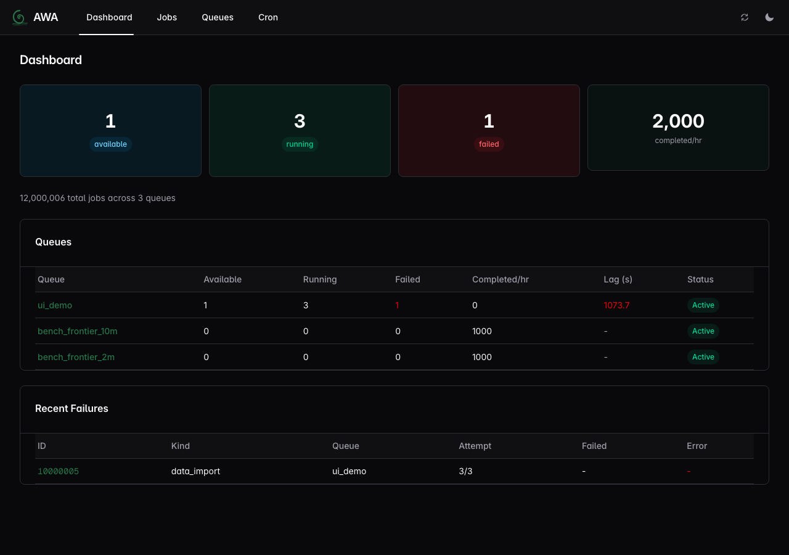

# Awa

**Postgres-native background job queue for Rust and Python.**

Awa (Māori: river) provides durable, transactional job enqueueing with typed handlers in both Rust and Python. The Rust runtime handles all queue machinery — polling, LISTEN/NOTIFY wakeups, heartbeating, crash recovery, dispatch — while Python workers run as callbacks via PyO3 on that same runtime, getting Rust-grade queue reliability with Python-native ergonomics.

## Features

- **Postgres-only** — no Redis, no RabbitMQ. One dependency you already have.
- **Transactional enqueue** — insert jobs inside your business transaction. Commit = job exists. Rollback = it doesn't.
- **Two first-class languages** — Rust and Python workers on the same queues with identical semantics.
- **SKIP LOCKED dispatch** — efficient, contention-free job claiming.
- **Heartbeat + deadline crash recovery** — stale jobs rescued automatically.
- **Priority aging** — low-priority jobs won't starve.
- **LISTEN/NOTIFY wakeup** — sub-10ms pickup latency.
- **Structured progress tracking** — handlers report percent, message, and checkpoint metadata; persisted across retries; flushed on every heartbeat.
- **OpenTelemetry metrics** — built-in counters, histograms, and gauges.
- **Hot/cold job storage** — runnable work stays in a hot table while deferred work stays in a cold deferred table.
- **Web UI** — built-in dashboard, job inspector, queue management, and cron controls.



## Quick Start (Rust)

```rust
use awa::{Client, QueueConfig, JobArgs, JobResult, JobError, JobContext, JobRow, Worker};
use serde::{Serialize, Deserialize};

#[derive(Debug, Serialize, Deserialize, JobArgs)]
struct SendEmail {
    to: String,
    subject: String,
}

#[async_trait::async_trait]
impl Worker for SendEmail {
    fn kind(&self) -> &'static str { "send_email" }

    async fn perform(&self, job: &JobRow, ctx: &JobContext) -> Result<JobResult, JobError> {
        let args: SendEmail = serde_json::from_value(job.args.clone())
            .map_err(|e| JobError::terminal(e.to_string()))?;
        send_email(&args.to, &args.subject).await
            .map_err(JobError::retryable)?;
        Ok(JobResult::Completed)
    }
}

// Insert a job
awa::insert(&pool, &SendEmail {
    to: "alice@example.com".into(),
    subject: "Welcome".into(),
}).await?;

// Transactional insert — atomic with your business logic
let mut tx = pool.begin().await?;
create_order(&mut *tx, &order).await?;
awa::insert(&mut *tx, &SendOrderEmail { order_id: order.id }).await?;
tx.commit().await?;

// Start workers
let client = Client::builder(pool)
    .queue("default", QueueConfig::default())
    .register_worker(SendEmail { to: String::new(), subject: String::new() })
    .build()?;
client.start().await?;
```

## Quick Start (Python)

```python
import awa
import asyncio
from dataclasses import dataclass

@dataclass
class SendEmail:
    to: str
    subject: str

client = awa.Client("postgres://localhost/mydb")

# Insert
await client.insert(SendEmail(to="alice@example.com", subject="Welcome"))

# Transactional insert — atomic with your business logic
async with await client.transaction() as tx:
    await tx.execute("INSERT INTO orders (id, total) VALUES ($1, $2)", order_id, total)
    await tx.insert(SendEmail(to="alice@example.com", subject="Order confirmed"))
    # Commits on success, rolls back on exception

# Worker
@client.worker(SendEmail, queue="email")
async def handle(job):
    await send_email(job.args.to, job.args.subject)

# Workers can report progress and checkpoint metadata
@client.worker(BatchProcess, queue="etl")
async def handle_batch(job):
    last_id = (job.progress or {}).get("metadata", {}).get("last_id", 0)
    for i, item in enumerate(fetch_items(after=last_id)):
        process(item)
        job.set_progress(int(100 * i / total), f"Processing item {i}")
        job.update_metadata({"last_id": item.id})
    await job.flush_progress()  # critical checkpoint

client.start([("email", 10)])
health = await client.health_check()
assert health.heartbeat_alive

await asyncio.sleep(10)
await client.shutdown()
```

> **Note:** `async with await client.transaction()` uses a double-await because
> `transaction()` is an async method that returns a context manager. This is
> inherent to the PyO3 async bridge pattern.

## Setup

```bash
# Run migrations once (not on every app startup)
awa --database-url $DATABASE_URL migrate
# Or from Python:
# await awa.migrate("postgres://...")
```

## Installation

### Rust

```toml
[dependencies]
awa = "0.2"
```

### Python

```bash
pip install awa-pg       # Python SDK (insert, worker, admin)
pip install awa-cli      # CLI binary (migrations, admin, serve)
```

### CLI

The `awa` CLI is available via pip (no Rust toolchain needed) or cargo:

```bash
# Via pip (recommended for Python users)
pip install awa-cli

# Via cargo (Rust users)
cargo install awa-cli
```

```bash
awa --database-url $DATABASE_URL migrate
awa --database-url $DATABASE_URL queue stats
awa --database-url $DATABASE_URL job list --state failed

# Start the web UI
awa --database-url $DATABASE_URL serve
# Open http://127.0.0.1:3000
```

## Architecture

```
┌──────────────────────┐    ┌──────────────────────┐
│  Rust producers      │    │  Python producers    │
│  awa-model / awa     │    │  pip install awa-pg  │
└──────────┬───────────┘    └──────────┬───────────┘
           │                           │
           └─────────────┬─────────────┘
                         ▼
              ┌─────────────────────┐
              │  PostgreSQL         │
              │  awa.jobs_hot       │
              │  awa.scheduled_jobs │
              │  awa.jobs (view)    │
              └──────────┬──────────┘
                         │
        ┌────────────────┼────────────────┐
        │                │                │
        ▼                ▼                ▼
┌───────────────┐ ┌───────────────┐ ┌───────────────┐
│ Rust runtime  │ │ Rust runtime  │ │ Rust runtime  │
│ + Rust worker │ │ + Python cb   │ │ + Python cb   │
│ awa-worker    │ │ via PyO3      │ │ via PyO3      │
└───────────────┘ └───────────────┘ └───────────────┘
```

All coordination happens through Postgres, and the Rust runtime owns polling, heartbeats, shutdown, and crash recovery for both Rust and Python handlers. Mixed Rust and Python workers coexist on the same queues — jobs inserted from any language are workable by any language.

Physically, Awa keeps runnable and actively-executing rows in `awa.jobs_hot`
and future-dated deferred rows in `awa.scheduled_jobs`. `awa.jobs` remains as a
compatibility view for SQL consumers, while dispatch and promotion operate on
the physical tables directly.

## Workspace

| Crate | Purpose |
|---|---|
| `awa` | Facade — re-exports everything |
| `awa-model` | Types, queries, migrations, admin ops |
| `awa-macros` | `#[derive(JobArgs)]` proc macro |
| `awa-worker` | Runtime: dispatch, heartbeat, maintenance |
| `awa-python` | PyO3 extension module |
| `awa-testing` | Test helpers (`TestClient`) |
| `awa-cli` | CLI binary |
| `awa-ui` | Web UI (axum API + React/IntentUI frontend) |

## Documentation

- [Architecture](docs/architecture.md)
- [ADR-001: Postgres-only](docs/adr/001-postgres-only.md)
- [ADR-002: BLAKE3 uniqueness](docs/adr/002-blake3-uniqueness.md)
- [ADR-003: Heartbeat + deadline hybrid](docs/adr/003-heartbeat-deadline-hybrid.md)
- [ADR-004: PyO3 async bridge](docs/adr/004-pyo3-async-bridge.md)
- [ADR-005: Priority aging](docs/adr/005-priority-aging.md)
- [ADR-006: AwaTransaction as narrow SQL surface](docs/adr/006-awa-transaction.md)
- [ADR-007: Periodic cron jobs](docs/adr/007-periodic-cron-jobs.md)
- [ADR-008: COPY batch ingestion](docs/adr/008-copy-batch-ingestion.md)
- [ADR-009: Python sync support](docs/adr/009-python-sync-support.md)
- [ADR-010: Per-queue rate limiting](docs/adr/010-rate-limiting.md)
- [ADR-011: Weighted concurrency](docs/adr/011-weighted-concurrency.md)
- [ADR-012: Split hot and deferred job storage](docs/adr/012-hot-deferred-job-storage.md)
- [ADR-013: Durable run leases and guarded finalization](docs/adr/013-run-lease-and-guarded-finalization.md)
- [ADR-014: Structured progress and metadata](docs/adr/014-structured-progress.md)
- [Web UI design](docs/ui-design.md)
- [Benchmarking notes](docs/benchmarking.md)
- [Validation test plan](docs/test-plan.md)
- [TLA+ correctness models](corectness/README.md)

## License

MIT OR Apache-2.0
