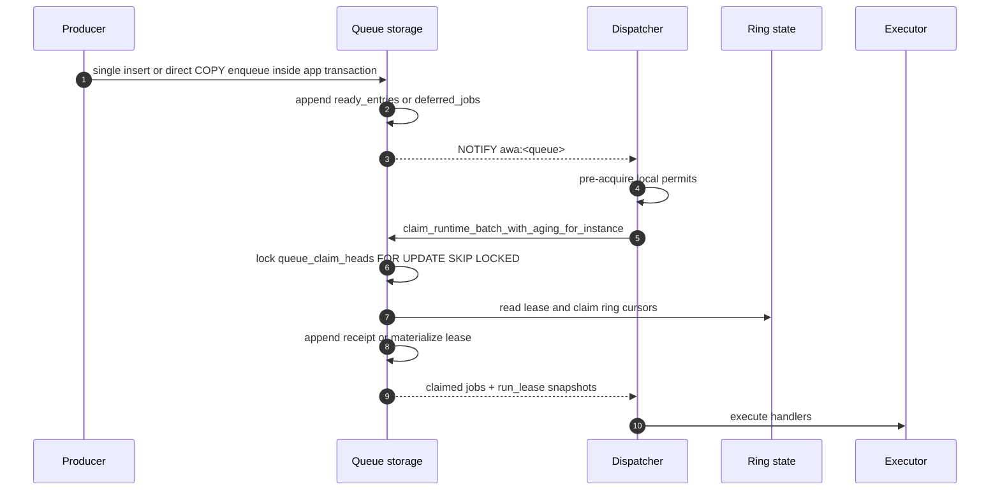
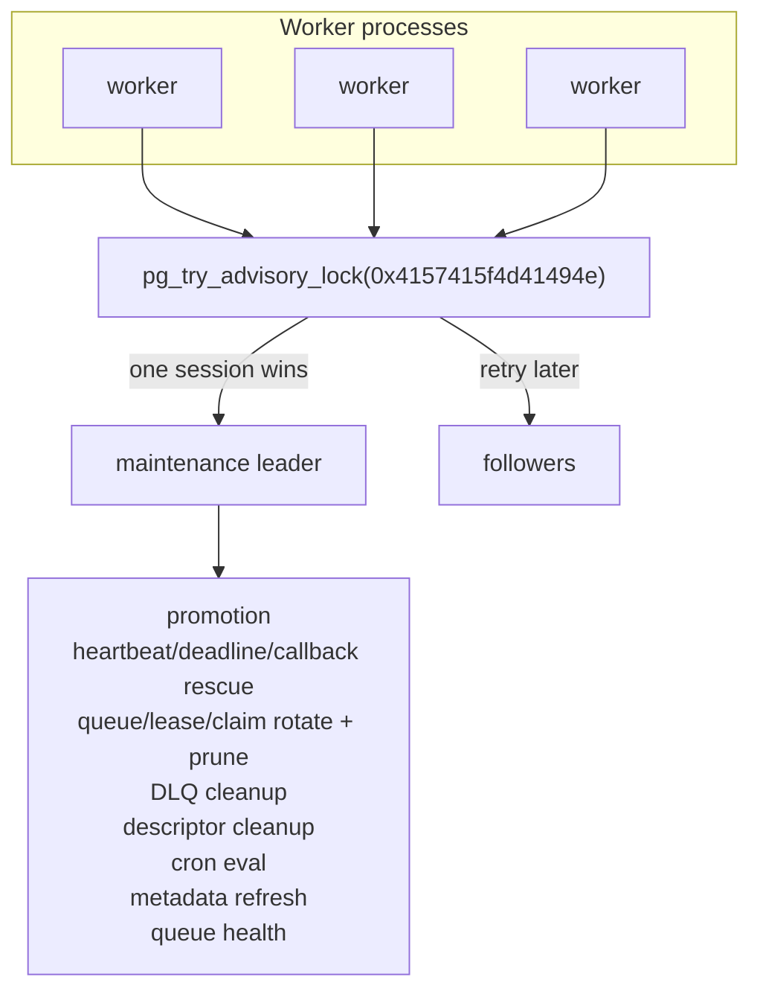

# Awa Architecture Overview

Awa (Māori: river) is a Postgres-native background job queue for Rust and
Python. Postgres is the sole infrastructure dependency: there is no Redis,
RabbitMQ, sidecar scheduler, or separate lease store. Producers enqueue inside
ordinary Postgres transactions, workers claim and complete jobs through the
same database, and one elected worker runs cluster-wide maintenance.

This document is ordered by the questions operators and contributors usually
need answered first:

- What owns the runtime?
- What deployment assumptions shape that runtime?
- Where does state live?
- How does a job move through storage?
- How does Awa recover from crashes and stale attempts?
- How are partitions rotated and reclaimed?
- Which surfaces are operational rather than hot-path?

For migration details see [migrations.md](migrations.md). For user-facing
knobs see [configuration.md](configuration.md).

## Runtime Shape

The runtime is three cooperating layers:

| Layer | Owns | Notes |
|---|---|---|
| Application code | Producer transactions, Rust handlers, Python handlers, optional HTTP worker targets | Enqueue can commit or roll back with the application's own writes. Rust and Python workers share the same storage engine. |
| Worker runtime | Dispatchers, executor tasks, guarded completion, per-process heartbeat refresh, maintenance leader election | Every worker process runs these services. Only one process wins the maintenance lock at a time. |
| Postgres | Queue state, execution state, control metadata, uniqueness, cron rows, runtime snapshots | Postgres is the coordination point for visibility, claim ownership, recovery, callbacks, and operator state. |

The important ownership split is simple: every worker can dispatch and
heartbeat its own attempts, but exactly one elected maintenance leader runs
cluster-wide promotion, rescue, queue/lease/claim ring rotation and prune, DLQ
cleanup, descriptor cleanup, cron evaluation, metadata refresh, and
queue-health publication.

## Deployment Model

- Awa assumes one shared Postgres database and any number of Rust or Python
  worker processes.
- Each process registers the queues and job kinds it can execute.
- Queue work is awakened by `LISTEN/NOTIFY` with polling as the fallback.
- The maintenance leader is elected inside the same worker fleet; no `pg_cron`
  or external scheduler is required.
- Long analytical reads should run on replicas or with disciplined timeouts,
  because long-lived primary transactions can delay best-effort partition
  prune.

## Storage Planes

Queue storage is the worker engine in 0.6. It is not one mutable jobs heap; it
is split into queue, execution, and control planes so each plane carries the
right kind of churn.

| Plane | Tables | Shape | Why it matters |
|---|---|---|---|
| Queue | `ready_entries_*`, `done_entries_*` | Ring partitions by `ready_slot` | Runnable and terminal rows stay append-first and are reclaimed by queue-ring prune. |
| Queue backlog | `deferred_jobs` | Plain table | Scheduled and retryable work stays out of the hot claim path until promotion. |
| Operator hold | `dlq_entries` | Plain table | DLQ rows are explicit operator backlog with retry, purge, and retention cleanup. |
| Receipt execution | `lease_claims_*`, `lease_claim_closures_*` | Ring partitions by `claim_slot` | Short attempts avoid mutable lease rows; live receipts are claims anti-joined with closures. |
| Materialized execution | `leases_*`, `attempt_state` | Lease ring plus mutable state table | Attempts escalate here when they need callback waiting, progress, or other mutable attempt state. |
| Control | `queue_lanes`, heads, ring-state tables, `queue_meta`, descriptors, runtimes, cron, uniqueness | Narrow metadata tables | Claim cursors, queue state, operator metadata, uniqueness, and liveness are kept separate from payload history. |

The asymmetry is intentional. Ready/done, lease, and receipt tables are
ring-pruned because they are hot. Deferred and DLQ rows are backlog/hold tables
with their own promotion, retry, purge, and retention paths. Control tables
stay narrow because they are the coordination surface dispatchers and
maintenance touch most often.

## Storage Surfaces

Most applications should use the Rust, Python, CLI, or UI APIs rather than
querying queue-storage tables directly. The SQL objects still matter for
operators, adapters, and incident read-outs, so Awa separates read surfaces from
physical transition surfaces:

| Surface | Role | Consumer contract |
|---|---|---|
| `awa.jobs` / `awa.insert_job_compat()` | Canonical compatibility surface used during the storage transition and by SQL adapters that need the public job shape. When queue storage is active, the runtime does not claim or complete from `awa.jobs`; compatibility inserts route into the active backend. | Public compatibility surface. Prefer Rust/Python/adapter APIs for ordinary writes. For high-volume queue-storage producers, prefer configured direct COPY through `QueueStorage::enqueue_params_copy()` or Python `enqueue_many_copy()` rather than the compat COPY path. |
| `{schema}.terminal_jobs` | Read-only hydrated view over queue-storage terminal history. It joins narrow `done_entries_*` rows back to retained `ready_entries_*` bodies. | Public read surface for SQL inspection and reporting of terminal queue-storage rows. It is not a write or transition surface. |
| `ready_entries_*` | Physical runnable queue ring. | Internal storage. Read only for low-level debugging; writes must go through Awa enqueue, claim, retry, cancel, or maintenance paths. |
| `done_entries_*` | Physical terminal fact ring. Ready-backed terminal rows can intentionally omit duplicated body columns. | Internal storage. Direct readers must tolerate nullable duplicated body fields; use `{schema}.terminal_jobs` for hydrated terminal rows. |
| `deferred_jobs` | Physical scheduled/retryable backlog table. | Internal storage. Promotion, retry, snooze, and cancellation own its transitions. |
| `dlq_entries` | Durable operator hold table for DLQ-enabled terminal failures. | Operator surface through CLI/UI/API; direct SQL inspection is reasonable, direct mutation is not. |
| `lease_claims_*` / `lease_claim_closures_*` | Receipt-plane execution history for short attempts. | Internal storage. Live receipt attempts are claims without matching closures. |
| `leases_*` / `attempt_state` | Materialized execution state for heartbeat, callbacks, progress, and other mutable attempt data. | Internal storage. Runtime and rescue paths own mutations. |
| `queue_lanes`, queue heads, ring-state tables, `queue_meta` | Claim cursors, enqueue heads, rotation/prune state, and queue storage configuration. | Internal control surface except documented configuration fields such as `queue_meta.enqueue_shards`. If no `queue_meta` row exists for a queue, enqueue defaults to one shard; operators should configure shard counts with an UPSERT before load tests or production traffic. |
| descriptors, runtime snapshots, cron tables | Operator metadata and scheduler declarations. | Public through Awa APIs and UI; SQL reads are acceptable for reporting. Writes should go through the corresponding Awa APIs. |

ADR-019 is the storage-engine source of truth; ADR-023 supersedes it for the
receipt plane, and ADR-026 refines terminal history:

- [ADR-019: Queue Storage Engine](adr/019-queue-storage-redesign.md)
- [ADR-023: Receipt Plane Ring Partitioning](adr/023-receipt-plane-ring-partitioning.md)
- [ADR-026: Narrow Terminal History](adr/026-narrow-terminal-history.md)

## Job Lifecycle

Core transitions:

| From | To | Trigger |
|---|---|---|
| insert | `available` | Immediate enqueue. |
| insert | `scheduled` | Future `run_at`. |
| `scheduled` / `retryable` | `available` | Maintenance promotion when `run_at <= now()`. |
| `available` | `running` | Dispatcher claim; `run_lease` increments. |
| `running` | `completed` | Handler succeeds. |
| `running` | `retryable` | Handler returns retryable failure or snooze/backoff path. |
| `running` | `waiting_external` | Handler parks for callback or sequential wait. |
| `waiting_external` | `running` | `resume_external` resumes a sequential wait. |
| `running` / `waiting_external` | `cancelled` | Handler cancel, admin cancel, or rescue cancellation. |
| `running` / `waiting_external` | `failed` | Attempts exhausted, terminal error, or callback timeout exhaustion. |
| `failed` | `dlq_entries` | Optional per-queue DLQ routing. |

`run_lease` increments at claim time. Runtime mutations carry
`(job_id, run_lease)`, so stale completions, retries, snoozes, cancels, and
callback resumes lose after rescue, admin cancellation, or re-claim.

Terminal rows differ by storage backend:

- In queue storage, `completed`, ordinary `failed`, and `cancelled` snapshots
  live in `done_entries_*` and are reclaimed by queue-ring prune. Ready-backed
  terminal rows are narrow: immutable job-body fields stay in the retained
  `ready_entries_*` row and public/admin reads hydrate through the storage
  surfaces described above. If a transition deletes the ready row first, such
  as cancelling an unclaimed available job, the terminal row is written wide
  instead.
- DLQ-enabled terminal failures are routed or moved into `dlq_entries`
  instead of ordinary terminal history; that table has explicit retention
  cleanup plus operator retry/purge.
- In the canonical compatibility path, terminal rows in `awa.jobs_hot` use
  row-by-row retention cleanup.

Progress is cleared on successful completion and preserved across retry,
snooze, cancel, fail, and rescue. On queue storage, mutable progress snapshots
live in `attempt_state` once an attempt first needs that mutable state; they
are not rewrites of the immutable ready row. Cancellation is cooperative for
live handlers: Rust handlers can poll `ctx.is_cancelled()`, Python handlers can
poll `job.is_cancelled()`, and stale storage writes are still rejected by the
`run_lease` guard if a handler misses the signal.

## Enqueue And Claim



Enqueue is transactional: if the producer's outer transaction rolls back, the
job never becomes visible. Immediate jobs append to `ready_entries_*`; future
scheduled or retryable jobs append to `deferred_jobs`.

There are two COPY-shaped producer paths:

- Direct queue-storage COPY is the high-throughput path: Rust producers use a
  configured `QueueStorage::enqueue_params_copy()`, and Python producers use
  `enqueue_many_copy()`. Direct-copy producers must use the same queue-storage
  configuration as the worker fleet, especially `queue_stripe_count` /
  `queue_storage_queue_stripe_count`.
- `insert_many_copy()` is the compatibility path. It stages rows with COPY but
  then routes each row through `awa.insert_job_compat()`, so it preserves the
  public compatibility surface rather than bypassing to the direct producer
  path.

Claim is cursor-based rather than heap-scan based:

- `queue_meta.enqueue_shards` controls how many independent enqueue/claim head
  rows a queue has. The default is one shard. Raising it changes the ordering
  contract to FIFO within `(queue, priority, enqueue_shard)`, with no global
  ordering promise across shards.
- `queue_enqueue_heads` allocates lane sequence ranges at enqueue time per
  `(physical queue, priority, enqueue_shard)`.
- `queue_claim_heads` advances monotonically during claim and is the authority
  for the next claimable lane position on the same shard-qualified lane.
- The dispatcher pre-acquires execution permits before claiming, so every
  claimed `running` job has reserved local capacity.
- Queue striping and bounded claimers reduce contention on very hot logical
  queues. Per-queue `claimers` can add dispatcher/claimer loops inside one
  runtime, but those loops share the queue's worker permits and rate limiter;
  they do not own jobs. Recovery still follows the receipt/lease state in
  Postgres.

Priority ordering is by effective priority first. Within one enqueue shard the
lane sequence is FIFO; across enqueue shards, strict global lane order is not
promised. With queue storage, priority aging is applied at claim time rather
than by physically rewriting ready rows. The ready/done/lease partitions carry
shard-aware lane indexes on `(queue, priority, enqueue_shard, lane_seq)` so
deep backlog claim probes do not scan a non-shard-selective lane index and
post-filter most rows.

## Completion And Callbacks

Handler results finalize through guarded storage transitions:

```text
handler result
    ├── Completed      -> close attempt, append done_entries(completed)
    ├── RetryAfter     -> close attempt, append deferred_jobs(retryable)
    ├── Snooze         -> close attempt, append deferred_jobs without attempt bump
    ├── Cancel         -> close attempt, append done_entries(cancelled)
    ├── Terminal error -> close attempt, append done_entries(failed) or dlq_entries
    └── Retryable err  -> close attempt, append deferred retry or terminal failure
```

Two callback modes share the same attempt guard:

- **Parked callback.** The handler registers a callback token and returns
  `WaitForCallback`; the runtime frees the task slot and moves the attempt to
  `waiting_external` until a signed callback completes, fails, retries, or
  resumes it.
- **Sequential wait.** The handler calls `wait_for_callback()` and stays
  suspended; `resume_external` writes the callback result and returns the same
  attempt to `running` so the handler can continue.

Callback tokens are attempt-specific. Stale tokens and stale completions are
rejected after a newer claim or terminal transition. The `awa-ui` HTTP callback
receiver verifies `X-Awa-Signature` when `AWA_CALLBACK_HMAC_SECRET` is set;
custom callback receivers must provide equivalent authentication. See
[HTTP workers and callback signatures](http-callbacks.md) for the concrete
endpoint and signing contract.

## Recovery Model

Awa has three rescue paths:

- **Stale heartbeat rescue.** Each worker heartbeats the attempts it owns.
  The maintenance leader rescues attempts whose heartbeat is older than
  `heartbeat_staleness` (default 90s).
- **Hard deadline rescue.** Per-queue deadlines write `deadline_at` onto
  receipt or lease rows. The maintenance leader closes expired attempts and
  routes them through the normal retry/fail/DLQ path.
- **Callback-timeout rescue.** Waiting attempts with expired callback timeouts
  are moved back through the same guarded finalization machinery.

Rescue closes the old attempt before making work available again. If the old
handler later writes a completion, the `run_lease` guard rejects it as stale.
When rescue happens in a process that still has the handler registered, the
runtime also flips the in-memory cancellation flag.

## Partition Rotation And Reclamation

Queue storage has three independent rings, each advanced by the elected
maintenance leader:

| Ring | Partitions | Default cadence | Rotate requires | Prune requires |
|---|---|---:|---|---|
| Queue | `ready_entries_*`, `done_entries_*` | `1000ms` | incoming ready/done slot is empty | oldest non-current slot has no active leases and no pending ready rows; terminal rows in that ready segment are reclaimed with their retained ready bodies |
| Lease | `leases_*` | `50ms` | incoming lease slot is empty | oldest initialized non-current lease slot is empty |
| Claim | `lease_claims_*`, `lease_claim_closures_*` | matches queue ring | incoming claims/closures slot is empty | every claim in the oldest non-current slot has a matching closure |

The maintenance tick for each ring is deliberately small: attempt one rotate,
then attempt one prune. If a partition is busy, blocked by a lock, current, or
still live, the tick records a skipped/blocked outcome and tries again on a
future interval.

The common safety pattern is:

1. Lock the ring-state row with `FOR UPDATE`.
2. Choose the incoming or oldest initialized slot.
3. Use a short `SET LOCAL lock_timeout = '50ms'` before child-table
   `ACCESS EXCLUSIVE` locks in prune paths.
4. Recheck liveness after acquiring the partition lock.
5. `TRUNCATE` only partitions that are proven inactive.

This is why queue storage's hot-path reclamation is a rotation-and-prune
discipline, not ordinary row-by-row vacuum cleanup. Ordinary retention cleanup
still exists for DLQ rows, stale descriptors, stale runtime snapshots, and the
canonical compatibility path.

## Maintenance Leader



The advisory lock is session-scoped. If the leader process or database
connection dies, Postgres releases the lock and another worker can win the next
election. Heartbeat refresh is not leader-elected; only cluster-wide rescue and
maintenance scans are.

## Operator Surfaces

### Descriptors And Runtime Liveness

Awa keeps operator-facing descriptor catalogs separate from per-job metadata:

- `awa.queue_descriptors` labels and documents queues.
- `awa.job_kind_descriptors` labels and documents job kinds.
- `awa.runtime_instances` reports live runtimes and descriptor hashes.

Descriptors are code-declared by Rust `ClientBuilder` or Python `AsyncClient`.
Workers upsert their declared descriptors at startup and on runtime snapshot
ticks. Admin APIs derive:

- **stale**: no live runtime has refreshed the descriptor recently.
- **drift**: live runtimes report conflicting descriptor hashes.

The maintenance leader deletes descriptor rows whose `last_seen_at` is older
than `descriptor_retention` (default 30 days). Runtime liveness rows are
garbage-collected on a shorter horizon.

### DLQ

The Dead Letter Queue is not a dispatchable `job_state`; it is a separate hold
table for failed snapshots that need operator action.

- DLQ policy is per queue.
- Retry deletes the DLQ row and inserts a fresh ready/deferred entry with
  `attempt = 0` and `run_lease = 0`.
- Purge deletes the DLQ row permanently.
- DLQ retention is independent of ordinary terminal history.

### Cron

Periodic jobs are declared by worker code and synchronized to `cron_jobs`.
Only the maintenance leader evaluates due schedules. Enqueue is atomic, so a
crash between evaluation and insert cannot create half-visible work.

## Observability And Correctness

Awa emits tracing spans and OpenTelemetry metrics for enqueue, claim,
execution, completion, rescue, rotation, prune, DLQ, queue depth, runtime
health, and callback flows. The Grafana dashboards in
[`docs/grafana`](grafana/README.md) use those metrics plus SQL panels for
storage-level inspection.

Core safety invariants are modeled in TLA+:

| Model | Focus |
|---|---|
| [`AwaCore`](../correctness/core/AwaCore.tla) | job lifecycle, retry/fail/cancel transitions, callback states |
| [`AwaBatcher`](../correctness/core/AwaBatcher.tla) | guarded completion batching and stale-result rejection |
| [`AwaExtended`](../correctness/protocol/AwaExtended.tla) | multi-instance shutdown, rescue, permit, leadership, and bounded fairness protocol |
| [`AwaSegmentedStorage`](../correctness/storage/AwaSegmentedStorage.tla) | queue-storage lifecycle, rotate/prune safety, DLQ round-trip, receipt rescue |
| [`AwaSegmentedStorageRaces`](../correctness/storage/AwaSegmentedStorageRaces.tla) | claim-vs-rotate/prune interleavings |
| [`AwaSegmentedStorageTrace`](../correctness/storage/AwaSegmentedStorageTrace.tla) | concrete runtime trace acceptance for representative queue-storage flows |
| [`AwaShardedPrune`](../correctness/storage/AwaShardedPrune.tla) | cross-shard ready/done prune matching by `enqueue_shard` |
| [`AwaStorageLockOrder`](../correctness/storage/AwaStorageLockOrder.tla) | Postgres lock ordering across claim, rotate, and prune |
| [`AwaStorageTransition`](../correctness/storage/AwaStorageTransition.tla) | queue-storage transition prepare, mixed-entry, finalize, and abort gates |
| [`AwaDeadTupleContract`](../correctness/storage/AwaDeadTupleContract.tla) | hot-table reclaim-kind contract for partition truncate and bounded warm tables |
| [`AwaCbk`](../correctness/races/AwaCbk.tla) | callback registration/resume/finalization races |
| [`AwaDispatchClaim`](../correctness/races/AwaDispatchClaim.tla) | availability re-check at dispatch claim commit |
| [`AwaViewTrigger`](../correctness/races/AwaViewTrigger.tla) | `awa.jobs` view trigger concurrency and version checks |
| [`AwaCron`](../correctness/races/AwaCron.tla) | cron double-fire prevention under leader failover |

The storage model-to-code correspondence is maintained in
[`correctness/storage/MAPPING.md`](../correctness/storage/MAPPING.md). Runtime
tests replay representative storage traces against these models, and the
benchmark notes document long-horizon partition and dead-tuple validation for
ADR-019 and ADR-023. Public SQL projections such as `awa.jobs` and admin
counts are treated as refinements over the modeled storage state; they need
code-level regression tests as well as TLA+ lifecycle coverage.

## Crate Structure

```text
awa (workspace)
├── awa-macros        proc macro: #[derive(JobArgs)]
├── awa-model         types, SQL, migrations, insert/admin/cron APIs
├── awa-worker        runtime: client, dispatcher, executor, heartbeat, maintenance
├── awa               facade crate re-exporting model + worker APIs
├── awa-testing       integration-test helpers
├── awa-ui            axum API + embedded React dashboard
├── awa-cli           migrations, admin, storage, and web UI CLI
└── awa-python        PyO3 Python bindings
```

`awa-model` owns schema and storage APIs. `awa-worker` owns runtime behavior.
`awa` is the normal Rust facade. `awa-python` embeds the same worker runtime
behind Python bindings, so mixed Rust/Python fleets share storage semantics.
