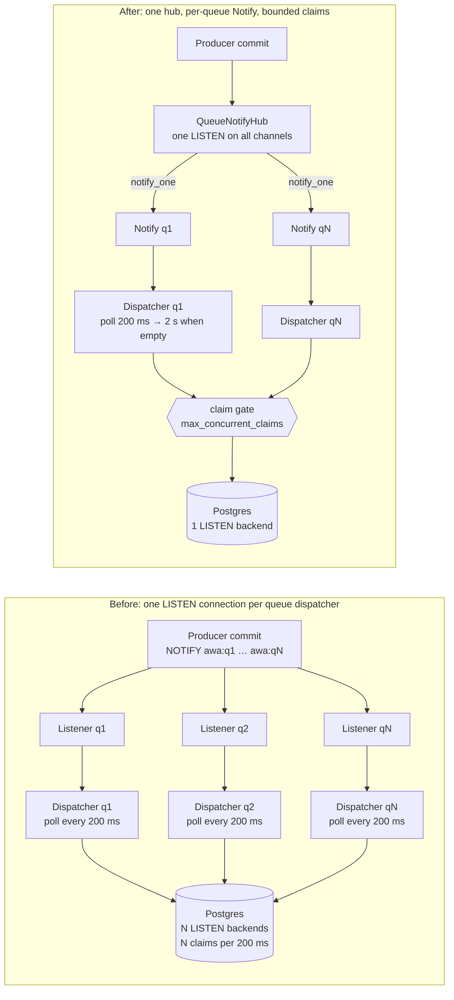
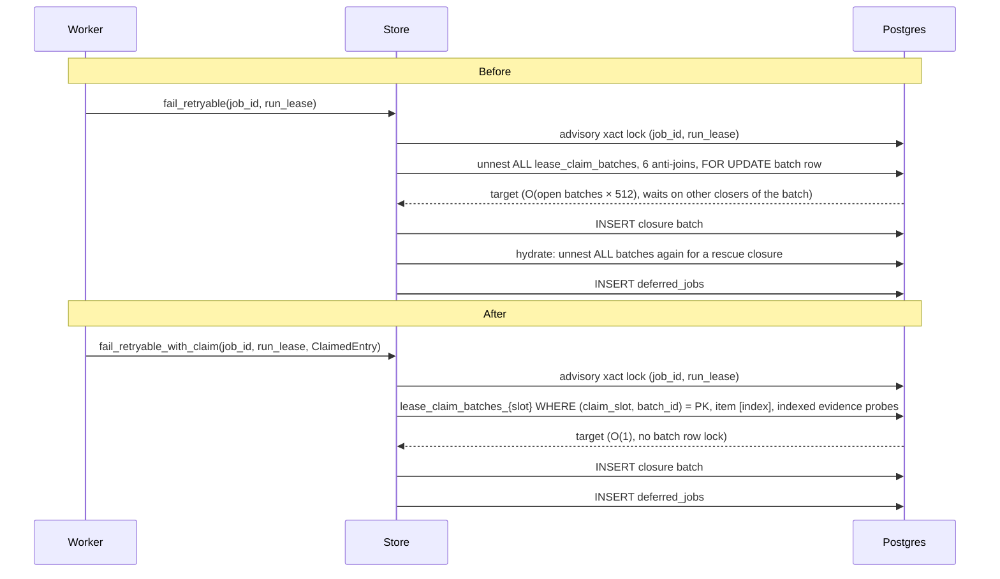

# Queue storage efficiency: bottleneck map and design

Status: design with measured prototypes (branch `brian/qs-efficiency-design`,
stacked on #506, #507, #508). Scope: the queue-storage engine only.

Goal: make awa competitive across the benchmark matrix with **no degenerate
shapes**. A degenerate shape is one where cost grows with something other
than the work done: with the number of queues, with the number of in-flight
attempts, with time while idle, or with the rotation cadence.

All measurements below are from `awa-bench` replicas run directly against a
fresh PostgreSQL 18.6 container capped at 4 CPUs on a SATA SSD (~7 ms fsync),
with `pg_stat_statements` (`track_planning = on`) and 100 ms wait-event
sampling. Other benchmarks shared the host, so absolute numbers carry noise;
where it matters, variants were run back to back. Cell names:

| Cell | Shape |
| --- | --- |
| `w64` | 1 replica, 64 workers, depth-target 4,000, 1 ms jobs (saturation) |
| `w4` | 1 replica, 4 workers, depth-target 4,000, 1 ms jobs (low concurrency) |
| `2x200` | 2 replicas × 200 jobs/s offered, 8 workers each (moderate) |
| `800` | 1 replica, 800 jobs/s offered, 32 workers (reference cell) |
| `idle` | 2 replicas, 8 workers, offered 0 |
| `retry` | `2x200` with every third job failing its first attempt (`JOB_FAIL_FIRST_MOD=3`) |
| `fan50` / `fan200` | 1 replica, 200 jobs/s round-robined over 50 / 200 queues, `MAX_CONNECTIONS` 120 / 300 |
| `long` | 2 replicas, 60 workers each, 40 s jobs |

## 1. Bottleneck map

### 1.1 Where a job's cost goes

Per completed job at the four load points (baseline = #508 head):

| Cell | done/s | xacts/job | WAL B/job | claims/s | rows/claim | claim mean | relfilenode swaps/s | top waits |
| --- | ---: | ---: | ---: | ---: | ---: | ---: | ---: | --- |
| `w64` | 6,062 | 0.09 | 935 | 210 | 29 | 3.1 ms | 20.5 | CPU, WalSync, WALWrite |
| `800` | 796 | 0.43 | 1,192 | 143 | 5.6 | 1.9 ms | 33.6 | WalSync, CPU, WALWrite |
| `2x200` | 391 | 1.51 | 1,695 | 297 | 1.3 | 1.9 ms | 24.8 | CPU, WalSync, WALWrite, **Lock:advisory** |
| `w4` | 421 | 1.26 | 1,824 | 196 | 1.0 | 3.2 ms | 20.0 | CPU, WalSync, WALWrite |

Reading across the rows: the engine is efficient when a claim carries many
rows (`w64`: 0.09 transactions and 935 B of WAL per job) and expensive when
it carries one. A one-row claim writes a `ready_claim_attempt_batches` row
and a `lease_claim_batches` row (about 2.4 KB of WAL together, the two
`WITH lease_ring` / function-wrapper lines in `pg_stat_statements`), so at
`w4` the claim ledger costs more than the job itself. Everything below the
saturation cell is dominated by *per-claim* cost, not per-job cost.

Anatomy of one `claim_ready_runtime` call (`w64`, 29 rows):

| Statement | exec | plan | plans/calls |
| --- | ---: | ---: | ---: |
| lane probe (`SELECT claims.priority … FOR UPDATE SKIP LOCKED`) | 0.33 ms | 3.4 ms | 20 / 14,103 |
| claim CTE (`WITH lease_ring … INSERT … lease_claim_batches`) | 0.74 ms | 1.23 ms | **7,660 / 12,300** |
| head-row / tombstone / attempt-batch probes | 0.05 ms | 1.5 ms | 7,651 / 12,300 (attempt batch) |
| post-claim cursor advance (separate tx, `FOR UPDATE` on the head) | 0.13 ms | – | – |

So about 1.2–1.7 ms of a 3 ms claim is **planning**, and it recurs on 60% of
calls. Section 1.5 explains why.

### 1.2 Idle

Two replicas, one queue, offered 0:

| | xacts/s | WAL KB/s | tuples updated/s | relfilenode swaps/s |
| --- | ---: | ---: | ---: | ---: |
| baseline | 154.5 | 16.8 | 6.5 | 0 |
| river (coordinator's measurement) | 25 | – | – | 0 |

Rotation is already idle-skipped (0 swaps: the queue ring never rotates while
its current slot is empty). The idle cost is the dispatchers: 24 empty
`claim_ready_runtime` calls/s, 14 `queue_claimer_leases` UPDATEs/s (the
claimer-gate cache expires every 250 ms and re-acquires the lease row), 2
`queue_claimer_state` upserts/s, plus the maintenance ticks (`promote_due`
×2 every 250 ms, ring serialisers taking `FOR UPDATE` on the `*_ring_state`
singletons every second: 538 row locks in 67 s, each writing 54 B of WAL).
The WAL at idle is almost entirely those lease UPDATEs and row locks.

### 1.3 Many queues (degenerate)

Each queue dispatcher held its own `PgListener` connection, so 200 queues
pinned 200 pool connections and 200 `LISTEN` backends before any work ran;
with the default pool the runtime could not claim at all. With
`MAX_CONNECTIONS=300`:

| Cell | done/s (200 offered) | claim p50 / p99 | producer p99 | xacts/s | empty claims/s | claim mean | waits |
| --- | ---: | ---: | ---: | ---: | ---: | ---: | --- |
| `fan50` | 200 | 14 / 408 ms | 85 ms | 2,445 | ~300 | 0.9 ms | CPU, ClientRead, LockManager |
| `fan200` | 197 | 515 / 1,811 ms | 1,612 ms | 3,843 | 1,656 | **10.4 ms** | ClientRead, CPU, **LWLock:LockManager** |

Three mechanisms compound: every queue polls every 200 ms whether or not it
has work (1,000 polls/s at 200 queues), every enqueue batch notifies up to
200 channels and wakes 200 dispatchers at once, and each claim transaction
touches 40–60 relations (parents, pruned children, indexes, sequences), which
exceeds the fast-path lock slots and pushes hundreds of concurrent claimers
onto the shared lock manager (`LWLock:LockManager`). The claim's cost went
from 1 ms to 10 ms purely from concurrency.

### 1.4 Failure and retry (degenerate)

`retry` cell, baseline: completion collapsed to **87/s** against 400 offered,
claim p50 54 s, queue depth 27k, and the producer's insert p50 rose from 21 to
94 ms (p99 330 ms). Transaction-id waits dominated.

The cause is `close_open_receipt_claim_tx`, which every retryable failure,
terminal failure, DLQ routing, `retry_after` and `snooze` goes through. It
located the attempt with `CROSS JOIN LATERAL unnest(job_ids, run_leases,
receipt_ids)` over **every** `lease_claim_batches` row (no index can serve a
`WHERE items.job_id = $1` under an unnest), anti-joined six evidence
relations, then took `FOR UPDATE` on the whole batch row (up to 512
attempts), serialising against every other closer of that batch:

| Statement | calls | mean | buffers/call |
| --- | ---: | ---: | ---: |
| failure `row_target`/`batch_target` lookup | 4,033 | **247 ms** | 948 |
| `hydrate_deleted_leases_tx` rescue-closure write (same unnest) | 4,030 | 47 ms | 571 |
| slow completion of a retried job (`locked_batch_claims`, same unnest) | 12 | **19.3 s** | 416k |

The third line is the second half of the storm: a job that has been retried
carries an `errors` array, so its eventual success is not a fast-path
candidate and goes through `complete_runtime_batch_slow_in_tx`, whose batch
lookup had the same shape. Cost is O(open batches × batch size) per failure
and per retried completion, while the producer's enqueue shares the lane lock
with the retries' re-enqueue (`promote_due` reserves the same enqueue heads).
The compact *fast* completion path never had this problem: it addresses the
batch by `(claim_slot, batch_id)` and the item by `claim_batch_index`.

### 1.5 Rotation, catalog churn and plan invalidation

Under load each ring prunes one slot per `*_rotate_interval` (1 s). A prune
`TRUNCATE`s all 8 queue-ring children (or 4 claim-ring children) whether or
not they hold rows: `ready_tombstones_N`, `receipt_completion_tombstones_N`,
`lease_claims_N`, `lease_claim_closures_N` and `leases_N` are empty in
compact-receipt mode, so roughly 40% of the 20–34 relfilenode swaps/s are
pure catalog churn. Each TRUNCATE writes `pg_class` versions (and index
versions), which a stalled logical slot pins (`catalog_xmin`), and sends
relcache invalidations to every backend.

Invalidation matters because of how PL/pgSQL caches the claim statements.
The claim CTE's generic plan is costed at 174k (an `Append` over 16
partitions with runtime pruning) against a custom plan at 331, so the
planner never switches to the generic plan: after every invalidation each
backend plans **five custom plans and one generic plan** per statement
before settling back on custom plans, and then keeps planning custom plans
on every call. Measured in a single session against a 46k backlog:

| Mode | claim call | notes |
| --- | ---: | --- |
| auto (today) | 2.5–2.9 ms | claim CTE planned on every call (1.0–1.2 ms), probes 0.6 ms |
| `force_generic_plan` | 30 ms | the 174k cost estimate crosses `jit_above_cost`; JIT compiles every execution |
| `force_generic_plan` + `jit = off` | **1.3–1.65 ms** | executor-startup pruning removes 15 subplans; generic plan is as fast as custom |

Forcing generic plans is not a free win, though: a generic plan references
all 16 children, so every TRUNCATE of any child invalidates it (a custom plan
only references the child it pruned to), and a generic re-plan costs 6–14 ms
per statement per backend. At one rotation per second across 64 backends
that is more CPU than the per-call custom planning it would replace. Planning
cost and rotation cadence are therefore one problem, not two: either the
claim statements stop referencing the partitioned parents, or rotation gets
rarer, or both.

### 1.6 Long-running jobs

`long` cell (40 s jobs, 120 running): awa wrote 31 KB/s of WAL against
3–7 KB/s for the other engines in the coordinator's run. The heartbeat is a
small part of it (6 ticks in the window at 14.9 KB each, about 125 B per
running job per 30 s tick, one `attempt_state` upsert per job). Most of the
WAL is the one-row claims (section 1.1) and the enqueue path. The heartbeat's
*shape* is the concern: `upsert_attempt_state_from_receipts_tx` finds the
open claims with the same whole-table unnest as the failure path and takes
`FOR UPDATE` on every claim batch that has an in-flight item, so a
heartbeat tick blocks every failure and slow completion on those batches for
its duration, and its cost grows with the number of open batches.

### 1.7 Cursor coupling

The claim cursor is a PostgreSQL sequence advanced after the claim commits,
in a second transaction that takes `FOR UPDATE` on the same
`queue_claim_heads` row the claim locked with `SKIP LOCKED`. With #507 the
advance is evidence-guarded (it only moves past lane positions whose
`ready_claim_attempt_batches` row is visible), which closes the failover
hole. It still costs one extra transaction per claim (0.13 ms exec plus a
commit), and any claimer that wins the head between the claim's commit and
its advance reads a stale cursor, takes the spent-prefix path, moves the
cursor itself and returns empty: the 73% empty-claim rate at `2x200` is
mostly this and the NOTIFY fan-out, not lack of work.

## 2. Ranked proposals

Ranking weighs removal of degenerate behaviour and help for realistic
workloads (10 ms–minutes jobs, moderate concurrency, many queues) above
microbenchmark peaks.

### P1. One listener per runtime, idle poll back-off, bounded claim concurrency (prototyped)

*Problem:* section 1.3. *Change (worker only, no schema):* a `QueueNotifyHub`
opens one `PgListener`, `LISTEN`s on every `awa:{queue}` channel and signals a
per-queue `tokio::sync::Notify`; dispatchers wait on that. Consecutive empty
polls double the sleep from `poll_interval` to `idle_poll_interval` (default
2 s; reset by any notification or claimed job; disabled in poll-only mode so
a transaction-mode pooler keeps the old cadence). A runtime-wide semaphore
(`ClientBuilder::max_concurrent_claims`, default pool/4 clamped to 4..=64)
bounds concurrent claim round-trips.

*Correctness:* notifications remain a hint; the safety poll still runs. The
hub wakes every queue on reconnect because notifications sent during an
outage are lost, matching the per-dispatcher behaviour. `Notify::notify_one`
stores a permit, so a notification that arrives while a dispatcher is
draining is not lost. *Rolling upgrade:* none required. *Risk:* pickup
latency up to `idle_poll_interval` on a deployment whose notifications are
silently dropped (ADR roadmap #374 covers detecting that); the knob is
per-queue.

*Measured:* section 3.

### P2. Close receipt claims by batch identity (prototyped)

*Problem:* section 1.4. *Change (store + worker, no schema):* the worker
passes the `ClaimedEntry` it dispatched to new `*_with_claim` entry points
(`fail_retryable`, `fail_terminal`, `fail_to_dlq`, `retry_after`, `snooze`,
and their `_in_tx` forms). The close addresses `lease_claim_batches_{slot}`
by primary key and the item by index, probes closure evidence through the
per-child `(claim_slot, job_id, run_lease)` and GiST `receipt_ranges` indexes,
inserts the closure batch, and does not lock the batch row. The slow
completion path uses the same lookup. `hydrate_deleted_leases_tx` skips its
rescue-closure scan when the caller already wrote the closure.

*Correctness:* every closer already serialises per attempt through
`lock_receipt_attempts_tx` (advisory xact lock on `(job_id, run_lease)`),
which is exactly what the compact completion path relies on instead of a
batch row lock; the six evidence anti-joins are unchanged, so a stale hint
(already closed, rescued, or cancelled) returns `None` as before. The
unhinted entry points keep the generic lookup for callers without a claim.
*Rolling upgrade:* additive API; N−1 workers keep the generic path.

*Measured:* section 3.

### P3. Truncate only ring children that hold rows (prototyped)

*Problem:* section 1.5. *Change (store, no schema):* prune probes each
child with `EXISTS (SELECT 1 … LIMIT 1)` under the `ACCESS EXCLUSIVE` it
already holds and truncates only the non-empty ones. The prune outcome and
ledger append are unchanged, so an idle ring still reports `already_pruned`
and a new leader's conservative repeat swaps nothing.

*Correctness:* an empty child has nothing to reclaim; the gates that prove
the slot is reclaimable run before and after the lock exactly as before.
ADR-043's reclaim dispatcher (`awa_ring_slot_reclaim_v1`) keeps the same
allowlist (`LOCK TABLE ONLY`, `TRUNCATE TABLE ONLY`); the emptiness probe is a
static SELECT. *Rolling upgrade:* none.

### P4. Volume- and age-aware rotation cadence

*Problem:* section 1.5; rotation at a fixed 1 s invalidates plans in every
backend once per second per ring regardless of volume. *Proposal:* rotate
the queue and claim rings when the current slot is older than
`rotate_min_age` (default 5 s) **or** larger than `rotate_max_bytes`
(default 64 MB, from `pg_relation_size` of the children), whichever comes
first, keeping the 1 s tick as the decision cadence. The size cap bounds the
live ring at saturation (16 × 64 MB), the age floor cuts truncates and
invalidations by about 5× at moderate load. Measured by the coordinator:
queue 5 s / lease 2 s cut claim re-plans by ~4× and claim mean by ~10%.

*Correctness:* rotation safety does not depend on cadence (the ledger CAS
and busy/idle gates are unchanged); prune lag grows with the age floor, so
`failed_retention` re-homing and terminal-count rollups see fewer, larger
batches. Long-running jobs already hold slots open longer than 1 s. *Rolling
upgrade:* configuration only; this changes ADR-019's "lease and claim rings
rotate quickly" guidance from a fixed interval to a bounded one and should
be recorded in the ADR when adopted.

### P5. Claim statements that do not reference partitioned parents

*Problem:* section 1.5. The claim CTE's planning cost and its vulnerability
to invalidation both come from referencing `ready_entries`,
`ready_segments`, `ready_tombstones`, `ready_claim_attempt_batches` and
`lease_claim_batches` through their partitioned parents. The target slot and
the current claim slot are known before the CTE runs, so the CTE can address
the children directly (`format('%I.ready_entries_%s', …)` with `EXECUTE
USING`), the way the completion fast path already addresses
`lease_claim_batches_{slot}` from Rust. A direct-child plan has no `Append`,
costs a fraction of the parent plan to build, becomes generic after five
executions, and is invalidated only when *its* child is truncated (once per
16 rotations rather than once per rotation).

*Risk:* `EXECUTE` in PL/pgSQL plans each call unless the function keeps a
prepared statement per slot; the cheaper plan still makes this a net win, and
moving the claim CTE out of PL/pgSQL into a Rust-side prepared statement
per `(ready_slot, claim_slot)` avoids the re-plan entirely. This touches the
claim function body (v023 installer), so it ships as a function replacement
with the same signature: no expand/flip, N−1 and N claimers interoperate
because the evidence written is identical. Expected gain: 1–1.5 ms per claim
at all loads, i.e. the largest single lever for `w4`, `2x200` and `fan*`.

### P6. Fold the cursor advance into the claim (evidence-guarded)

*Problem:* section 1.7. With #507's guard the advance is "move the cursor to
`max(next_lane_seq)` of attempt batches visible at the head". The same
statement can run **at the start of the next claim** on that lane, inside
the claim transaction, before the lane probe: it reads only committed
`ready_claim_attempt_batches` rows (visible evidence), so an abort of the
surrounding claim cannot strand live rows, which is the invariant ADR-019
and ADR-033 require. That removes the post-claim transaction (one commit per
claim), the second `FOR UPDATE` on the head, and the stale-cursor empty
claim; the cursor is simply lazily caught up by whichever claimer next holds
the lane. The spent-prefix recovery path already does exactly this for
tombstones.

*Correctness:* unchanged invariant (the cursor only moves over committed
evidence); the TLA+ trace `AwaSegmentedStorageTraceLostClaimAdvance` already
models a lost post-commit advance as a normal state. *Rolling upgrade:* an
N−1 claimer still advances post-commit; both forms are idempotent `GREATEST`
moves on the sequence. Expected gain: one transaction per claim (0.9 → 0
extra xacts at `w4`, ~15% of claim wall time), and most of the 73% empty
claims at moderate load.

### P7. Claim coalescing for low concurrency

*Problem:* `w4` and `long`: each freed permit triggers a claim for one job,
and a one-row claim writes two ledger rows. *Proposal (worker only):* when a
capacity wake arrives and the previous claim returned a full batch (the lane
is not empty), wait up to `claim_coalesce` (default 2 ms, bounded by
`poll_interval`) for more permits before claiming, so a burst of completions
turns into one claim for several jobs. No reservation state, no prefetch
beyond permits actually held: it is the batching the design already allows
("`claim_batch_size` per round-trip"), applied to the capacity wake instead
of only to the poll. Fairness across replicas is unchanged (each still claims
only what it can run). Lease and deadline implications: none, jobs are
claimed only when a permit is held. Expected gain: 1.5–2× at `w4`-like shapes
(the earlier "capacity linger 2 ms" experiment measured 393/s vs 320/s with
p50 59 ms); the archived prefetch spike's failure mode (claims without
permits inflating `running_depth`) does not apply.

### P8. Heartbeat by claim identity

*Problem:* section 1.6. *Proposal:* the in-flight registry keeps the
`(claim_slot, claim_batch_id, claim_batch_index, receipt_id)` of each running
attempt; the heartbeat statement joins `unnest` of those against
`lease_claim_batches_{slot}` by primary key, without `FOR UPDATE`, and
upserts `attempt_state` as today. Cost becomes O(in-flight) instead of
O(open batches × batch size), and a heartbeat tick stops blocking failures.
Instance-level liveness (one heartbeat row per runtime, used by stale rescue)
would remove the per-job write entirely but needs an owner column on the
claim batch and an expand/flip; defer until P8 is measured.

### P9. Cheaper idle claims

With P1 the number of empty claims is bounded; their unit cost (lane probe
0.3 ms, claimer-gate re-acquire every 250 ms with a lease UPDATE every 3 s)
can drop further by (a) lengthening the gate cache TTL while a queue stays
empty (the gate only matters when there is work to share), and (b) a
head-difference probe (`sum(enqueue_cursor − claim_cursor)`, already the
backpressure signal) before the function call. Both are small; neither
changes evidence.

### Not proposed

- **Automatic enqueue sharding.** ADR-025 makes the shard count a semantic
  switch (partitioned FIFO). The producer-side lane lock contention seen at
  `2x200` (129 advisory-lock samples) comes from two replicas' producers and
  `promote_due` sharing one lane; the remedy is the operator knob plus P6/P7
  shortening the claim side, not silent re-sharding.
- **Server-wide `plan_cache_mode`.** ADR-044's guidance stands; section 1.5
  shows why a function-scoped generic plan is also wrong today (JIT and
  invalidation amplification). P5 removes the reason to want it.

## 3. Prototype results

Prototypes on this branch, each its own commit with tests:

| Commit | Content |
| --- | --- |
| `3c0f813` | P1: shared listener, idle poll back-off |
| `780c9b2` | P2: close compact receipt claims by batch identity |
| `ba4dba8` | P1b: bounded claim concurrency (`max_concurrent_claims`) |
| `59181a6` | P3: truncate only ring children that hold rows |
| `feb1cab` | P2b: slow completion addresses claim batches by identity |

### 3.1 First pass: baseline vs P1+P2 (runs hours apart, same conditions)

| Cell | Metric | baseline | P1+P2 |
| --- | --- | ---: | ---: |
| `idle` | xacts/s | 154.5 | **70.3** |
| `idle` | WAL KB/s | 16.8 | 15.9 |
| `idle` | tuples updated/s | 6.5 | 4.7 |
| `2x200` | done/s | 391 | 386 |
| `2x200` | claim p50 / p99 | 30 / 129 ms | **7 / 55 ms** |
| `2x200` | producer p50 / p99 | 21 / 71 ms | 2.4 / 6.3 ms |
| `retry` | done/s (400 offered) | **87** | **391** |
| `retry` | claim p50 / p99 | 54 s / 67 s | 150 ms / 3.4 s |
| `retry` | producer p50 / p99 | 94 / 330 ms | 6.3 / 86 ms |
| `retry` | queue depth | 27,024 | 16 |
| `fan50` | done/s, xacts/s | 200, 2,445 | 200, 2,224 |
| `fan200` | done/s, claim p50 | 197, 515 ms | 149, 1,270 ms |
| `fan200` | claim calls/s, claim mean | 1,656, 10 ms | 744, **58 ms** |
| `fan200` | LWLock:LockManager samples | 1,269 | 3,913 |

`fan200` got worse with P1 alone: halving the empty claims freed pool
connections, so the runtime ran far more claim transactions concurrently
and the 4-CPU server spent its time in the lock manager. The listener fix
is necessary (the default pool cannot even start otherwise) but the
concurrency bound (P1b) is what makes many queues non-degenerate; the
back-to-back table below separates the two.

### 3.2 Back-to-back comparison (same hour, variants alternated)

Variants: `base` = #508 head (`59b244f`); `p12` = P1+P2; `p123` = P1+P1b+P2+P2b+P3
(branch head). Every row is a fresh Postgres; `fan200` was run for all
three variants in sequence, the other cells alternated base/p123.

| Cell | Metric | base | p12 | p123 |
| --- | --- | ---: | ---: | ---: |
| `fan200` | done/s (200 offered) | 200 | 123 | **200** |
| `fan200` | claim p50 / p99 | 462 / 1,837 ms | 1,215 / 3,526 ms | **27 / 1,283 ms** |
| `fan200` | producer p99 | 1,341 ms | 2,381 ms | **236 ms** |
| `fan200` | queue depth | 30 | 97 | **2** |
| `fan200` | claim calls/s, mean | 1,633, 10.8 ms | 677, 79 ms | 1,100, **5.2 ms** |
| `fan200` | LWLock:LockManager samples | 755 | 4,734 | **173** |
| `fan200` | xacts/s | 3,758 | 2,243 | 4,053 |
| `retry` | done/s (400 offered) | **88** | – | **402** |
| `retry` | claim p50 / p99 | 53.5 s / 66.7 s | – | 35 ms / 2.7 s |
| `retry` | producer p99 | 283 ms | – | **23 ms** |
| `retry` | queue depth | 27,016 | – | 6 |
| `retry` | WAL B/job | 4,647 | – | 3,046 |
| `idle` | xacts/s | 157 | – | **70** |
| `idle` | WAL KB/s | 17.1 | – | 16.0 |
| `idle` | tuples updated/s | 6.5 | – | 4.7 |
| `2x200` | done/s, claim p50 / p99 | 397, 10 / 60 ms | – | 385, 12 / 73 ms |
| `2x200` | xacts/job, WAL B/job | 1.80, 1,795 | – | 1.77, 1,769 |
| `2x200` | relfilenode swaps/s | 32.8 | – | **20.1** |
| `w64` | done/s, claim p50 / p99 | 5,754, 495 / 734 ms | – | 5,957, 447 / 637 ms |
| `w64` | xacts/job, WAL B/job | 0.09, 924 | – | 0.09, 922 |
| `w64` | relfilenode swaps/s | 25.1 | – | **11.4** |
| `w4` | done/s | 454 | – | 435 |
| `w4` | xacts/job, WAL B/job | 1.40, 1,994 | – | 1.39, 1,917 |
| `w4` | relfilenode swaps/s | 22.8 | – | **10.6** |
| `long` | xacts/s, WAL KB/s | 183, 24.0 | – | **131, 17.1** |
| `long` | tuples updated/s | 21.7 | – | 14.2 |
| `long` | catalog dead-tuple delta (97 s) | +594 | – | +324 |
| `long` | relfilenode swaps/s | 10.6 | – | 5.9 |

Reading the table:

- The two degenerate shapes are gone. `retry` goes from 88/s with a 27k
  backlog and a 53 s claim p50 to full throughput at 400/s with a 6-row
  depth and a 23 ms producer p99 (the coordinator's "producer insert p99
  rising to ~100 ms while retries re-enqueue" was this lookup holding batch
  rows and lane locks). `fan200` goes from a 462 ms claim p50 and 1.3 s
  producer p99 to 27 ms and 236 ms at the same throughput, with the lock
  manager out of the wait profile.
- `p12` alone makes `fan200` worse (section 3.1 explained why): removing
  the per-queue listeners frees the pool, and without the claim gate the
  freed connections all become concurrent claims. P1 and P1b ship together.
- P3 halves relfilenode churn everywhere (`w64` 25 → 11/s, `w4` 23 → 11/s,
  `2x200` 33 → 20/s) and the catalog dead-tuple growth in the long-job cell,
  with no throughput cost; the remaining swaps are children that really hold
  rows, which only P4 (cadence) can reduce further.
- Idle transactions halve (157 → 70/s). The remainder is maintenance: the
  ring serialisers take a WAL-logged `FOR UPDATE` on each `*_ring_state`
  singleton on every rotate *and* prune tick before the idle gate is
  checked (8/s for the lease ring at the bench's 250 ms cadence, 54 B of WAL
  each), `promote_due` runs twice every 250 ms, and the claimer-gate cache
  re-acquires its lease row every 250 ms. Checking the idle gate before the
  serialiser lock and lengthening the gate TTL while idle (P9) would bring
  idle close to river's 25/s.
- Throughput-bound cells (`w64`, `w4`, `2x200`) are unchanged within noise:
  these prototypes remove degenerate cost, they do not shorten the claim
  itself. That is P5/P6/P7.
- `fan200`'s claim p99 (1.28 s) is now queueing on the claim gate (200
  queues sharing 64 slots on a 4-CPU server); p50 is 27 ms. Raising the
  gate trades p99 for lock-manager contention, so the right fix for the
  tail is a cheaper claim (P5) rather than a wider gate.

### 3.3 Tests

`cargo test -p awa-model` and the full `cargo test -p awa --test
queue_storage_runtime_test` (136 tests) pass on PostgreSQL 17 at the branch
head; `cargo fmt` and `cargo clippy --all-targets --all-features -D warnings`
are clean. New tests: `idle_poll_sleep_doubles_up_to_the_idle_cap`
(worker), `test_queue_storage_receipt_claim_hint_closes_compact_claim_once`,
and the idle-prune test now asserts that an empty child's relfilenode is
left alone.

## 4. Flows

### 4.1 Wake-up: before and after P1

### 4.2 Closing an attempt on failure: before and after P2

### 4.3 Claim and cursor: today and with P5+P6

```mermaid
flowchart TB
  subgraph today["Today"]
    A[BEGIN sync_commit=off] --> B[lane probe<br/>FOR UPDATE SKIP LOCKED head]
    B --> C[spent-prefix check<br/>tombstones / attempt batches]
    C --> D[claim CTE over partitioned parents<br/>custom plan every call]
    D --> E[COMMIT]
    E --> F[BEGIN: FOR UPDATE head,<br/>setval claim cursor<br/>evidence-guarded]
    F --> G[COMMIT]
  end
  subgraph proposed["With P5 + P6"]
    A2[BEGIN sync_commit=off] --> B2[lane probe<br/>FOR UPDATE SKIP LOCKED head]
    B2 --> C2[catch up cursor from visible<br/>attempt-batch evidence]
    C2 --> D2[claim CTE on ready_entries_slot /<br/>lease_claim_batches_slot<br/>generic plan, invalidated 1/16 rotations]
    D2 --> E2[COMMIT]
  end
```

## 5. Recommended order

1. Land P1 (+P1b), P2 (+P2b) and P3: they remove the three measured
   degenerate shapes without schema changes.
2. P6 then P5: both are claim-function changes with no evidence-format
   change, and together they take the per-claim floor from ~3 ms to roughly
   1 ms, which is what `w4`, `2x200`, `long` and `fan*` are bound by.
3. P4 with P5: once plans stop depending on the parents, rotation cadence is
   only a disk/catalog question and a bounded cadence is safe to default.
4. P7 and P8 for the low-concurrency and long-job shapes; P9 as polish.
