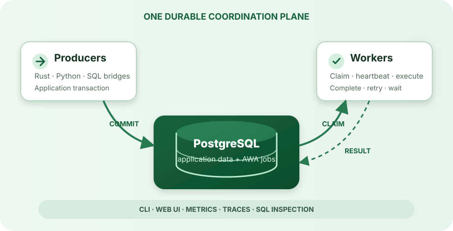

---
hide:
  - navigation
  - toc
---

<div class="awa-hero" markdown>
<div markdown>

# Background jobs that live with your data

AWA is a Postgres-native job queue for Rust and Python. Enqueue work in the same transaction as your application data, then run durable workers with retries, scheduling, progress, callbacks, and crash recovery.

<div class="awa-hero__actions" markdown>
[Start with Rust](getting-started-rust.md){ .md-button .md-button--primary }
[Start with Python](getting-started-python.md){ .md-button }
</div>

</div>
<div class="awa-hero__visual" markdown>

</div>
</div>

## One system of record

Business data and job state share PostgreSQL. A transaction either commits both the application change and its follow-up work, or neither. Workers claim runnable rows without a separate broker, keep active claims alive, and leave enough state behind for another worker to recover work after a crash.

<div class="awa-grid" markdown>
<a class="awa-card" href="concepts/transactional-enqueue/">
  <strong>Transactional by design</strong>
  <span>Commit an application write and its background job atomically.</span>
</a>
<a class="awa-card" href="concepts/job-lifecycle/">
  <strong>Durable execution</strong>
  <span>Persist attempts, retries, schedules, callback waits, and progress.</span>
</a>
<a class="awa-card" href="deployment/">
  <strong>Operable in production</strong>
  <span>Inspect queues with the CLI, web UI, metrics, traces, and SQL.</span>
</a>
</div>

## Pick the interface that fits your service

=== "Rust"

    ```bash
    cargo add awa
    ```

    Define typed job arguments, register async handlers, and use your existing `sqlx` pool for migrations, enqueueing, and administration.

    [Build a Rust worker →](getting-started-rust.md)

=== "Python"

    ```bash
    uv add awa-pg
    ```

    Register sync or async handlers around dataclasses and use direct clients or transaction bridges for asyncpg, psycopg, SQLAlchemy, and Django.

    [Build a Python worker →](getting-started-python.md)

=== "Operations"

    ```bash
    uv tool install awa-cli
    awa --database-url "$DATABASE_URL" health
    ```

    Run migrations, inspect jobs and queues, administer the dead-letter queue, and serve the optional web dashboard.

    [Explore the CLI →](reference/cli.md)

## Understand the boundaries

AWA provides **at-least-once delivery**: a handler may run more than once when a worker loses its claim or its completion write cannot be confirmed. Handlers should therefore be idempotent, or make their side effects transactional.

Start with [how AWA works](concepts/index.md), then use the [deployment](deployment.md), [security](security.md), and [troubleshooting](troubleshooting.md) guides before production.
