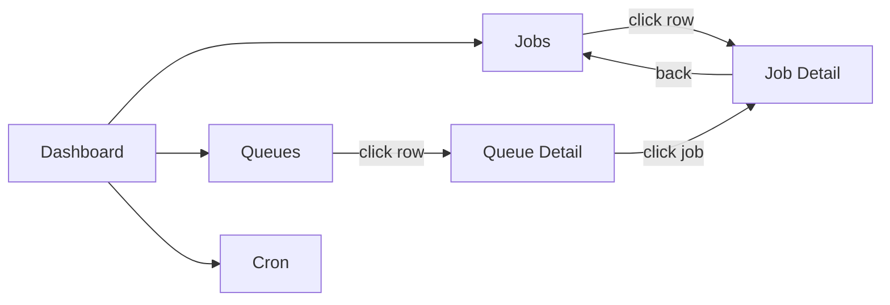

# AWA Web UI — Design Document

*Draft — March 2026*

---

## 1. Goals

Provide a standalone web UI for AWA that gives operators visibility into job processing
and the ability to take administrative actions, without querying Postgres directly or
using the CLI. The PRD positions this as a v0.4 deliverable in a separate `awa-ui` crate.

**Target users:** Developers and operators running AWA in production. Not end-users.

**Design principles:**
- **Operational, not analytical.** Show what's happening now and let users act on it.
  Deep historical analytics belong in Grafana via the existing OTel metrics.
- **Fast and lightweight.** Embedded in the worker binary or run standalone. No separate
  build step, no Node.js dependency at runtime. Static assets compiled into the binary.
- **Read-mostly, write-rarely.** Most visits are "check if things are healthy." Writes
  (retry, cancel, pause) are infrequent but critical.

---

## 2. Architecture

### 2.1 Crate: `awa-ui`

```
awa-ui/
  src/
    lib.rs          # Public API: AwaUi::router() -> axum::Router
    handlers/       # Axum handlers (JSON API)
      jobs.rs
      queues.rs
      cron.rs
      stats.rs
    api.rs          # Route definitions
  frontend/         # TypeScript SPA (built at release time, embedded via rust-embed)
    src/
      routes/
      components/
      services/
      stores/
    package.json
    vite.config.ts
```

**Integration pattern:** `awa-ui` exposes an `axum::Router` that can be mounted:

```rust
// Standalone (awa-ui binary or awa-cli serve)
let app = awa_ui::router(pool.clone());
axum::serve(listener, app).await?;

// Embedded in user's existing axum app
let app = my_app_router
    .nest("/awa", awa_ui::router(pool.clone()));
```

The frontend SPA is compiled with Vite, then embedded into the Rust binary via
`rust-embed`. The axum handler serves index.html for all non-API routes (SPA fallback).

### 2.2 Frontend stack

| Choice | Rationale |
|--------|-----------|
| **React 19 + TypeScript** | Industry standard. Same stack as RiverUI. Brian knows React. |
| **TanStack Router** | File-based routing with type-safe params. URL-driven state. |
| **TanStack Query** | Server state with auto-refetch, stale-while-revalidate, mutations. |
| **Tailwind CSS v4** | Utility-first. Dark mode via `dark:` prefix. Small bundle. |
| **Headless UI** | Accessible dropdowns, dialogs, transitions without style opinions. |
| **Heroicons** | Clean icon set. Same as RiverUI. |
| **date-fns** | Lightweight date formatting. |
| **Vite** | Fast builds, HMR for development. |

No heavy charting library initially. Use CSS-based sparklines or a lightweight library
(e.g., `uplot`) if charts are needed for the dashboard.

### 2.3 API layer

JSON REST API under `/api/`. All endpoints accept/return JSON.

```
GET  /api/stats                          # Dashboard summary
GET  /api/stats/timeseries?minutes=60    # Job counts over time (for sparklines)

GET  /api/jobs?state=&kind=&queue=&limit=&before_id=  # Paginated job list
GET  /api/jobs/:id                       # Single job detail

POST /api/jobs/:id/retry                 # Retry a job
POST /api/jobs/:id/cancel                # Cancel a job
POST /api/jobs/bulk-retry                # { ids: [...] }
POST /api/jobs/bulk-cancel               # { ids: [...] }

POST /api/jobs/retry-failed              # { kind: "..." } or { queue: "..." }
POST /api/jobs/discard-failed            # { kind: "..." }

GET  /api/queues                         # Queue list with stats
POST /api/queues/:name/pause             # Pause queue
POST /api/queues/:name/resume            # Resume queue
POST /api/queues/:name/drain             # Drain queue

GET  /api/cron                           # Cron job schedules
POST /api/cron/:name/trigger             # Trigger a scheduled job immediately

GET  /api/kinds                          # Distinct job kinds (for autocomplete)
```

**Backend queries:** The API handlers call existing `awa_model::admin::*` functions.
Some new queries are needed:
- `stats` summary (aggregate counts by state, total throughput)
- `timeseries` (bucketed counts by state over the last N minutes)
- `distinct kinds` (for filter autocomplete)
- Cursor-based pagination (`WHERE id < $before_id ORDER BY id DESC LIMIT $n`)

---

## 3. Navigation & Layout

### 3.1 Shell

**Top navigation bar** (horizontal tabs, like Sidekiq). Simpler than a sidebar for a
tool with 4-5 pages. Responsive: on mobile, tabs collapse into a hamburger menu.

- **Logo/title:** "AWA" (small, left-aligned). Links to dashboard.
- **Tabs:** Dashboard, Jobs, Queues, Cron
- **Right side:** Theme toggle (light/dark/system), auto-refresh indicator

> `[AWA]  Dashboard  Jobs  Queues  Cron  ·····················  [☀/☾]  [⟳ 2s]`

### 3.2 Pages

| Page | Path | Purpose |
|------|------|---------|
| Dashboard | `/` | Overview: health check at a glance |
| Jobs | `/jobs` | Job list with filtering by state, kind, queue |
| Job Detail | `/jobs/:id` | Full job inspection |
| Queues | `/queues` | Queue list with stats and pause/resume |
| Queue Detail | `/queues/:name` | Filtered job list for one queue |
| Cron | `/cron` | Periodic job schedules |



---

## 4. Page Designs

### 4.1 Dashboard (`/`)

The landing page answers: "Is my system healthy right now?"

Three sections, stacked vertically:

**Section 1 — State counter cards** (4-across row):

| Available | Running | Failed | Completed/hr |
|:---------:|:-------:|:------:|:------------:|
| **142** | **23** | **3** | **12,847** |

Each card is clickable (links to `/jobs?state=<state>`). Failed card uses red styling
when count > 0. Completed shows last-hour count since completed jobs are cleaned up.

**Section 2 — Queue summary table:**

| Queue | Available | Running | Failed | Lag | Status |
|-------|-----------|---------|--------|-----|--------|
| default | 89 | 15 | 2 | 1.2s | Active |
| email | 42 | 8 | 1 | 0.3s | Active |
| billing | 11 | 0 | 0 | 45.1s | **Paused** |

Clicking a row navigates to `/queues/:name`. Lag color-coded: green < 10s, amber 10–60s,
red > 60s.

**Section 3 — Recent failures** (last 5-10 failed jobs):

| ID | Kind | Queue | Attempt | Error | When |
|----|------|-------|---------|-------|------|
| #4821 | send_email | email | 3/25 | SMTP timeout | 2m ago |
| #4819 | process_order | default | 25/25 | DB deadlock | 5m ago |
| #4812 | send_email | email | 5/25 | Rate limited | 8m ago |

Clicking a row navigates to `/jobs/:id`.

**Auto-refresh:** Every 5 seconds via TanStack Query `refetchInterval`. Pauses when
the browser tab is backgrounded (pattern from Oban Web).

### 4.2 Jobs (`/jobs`)

The core page. Shows a filterable, paginated list of jobs.

**Layout (top to bottom):**

1. **State filter tabs** — horizontal pills with counts:
   `All(12,847)` | `Available(142)` | `Running(23)` | `Scheduled(7)` | `Retryable(4)` | `Failed(3)` | `Completed(12,668)` | `Cancelled(0)`

2. **Toolbar row** — search input (left), refresh indicator (right)

3. **Job table:**

   | | State | Kind | Queue | Attempt | Time |
   |---|---|---|---|---|---|
   | ☐ | `running` | send_email | email | 1/25 | 2s ago |
   | ☐ | `running` | process_order | default | 1/5 | 5s ago |
   | ☐ | `failed` | send_email | email | 25/25 | 1m ago |
   | ☐ | `retryable` | generate_report | default | 3/10 | 30s ago |

4. **Footer** — bulk action toolbar (when selected) + cursor pagination

**State filter tabs:** Horizontal pill-style tabs showing each state with a count badge.
Clicking a tab sets `?state=<state>` in the URL. "All" shows everything.
Inspired by RiverUI's state sidebar but rendered as horizontal tabs to save horizontal
space. Counts update on each refetch.

**Search/filter bar:**
- Text input with autocomplete suggestions (like RiverUI's `kind:`, `queue:` colon syntax)
- Selected filters appear as removable badge chips
- Supported filters: `kind:<value>`, `queue:<value>`, `tag:<value>`
- Autocomplete values fetched from `/api/kinds` and queue list

**Job table columns:**
| Column | Content | Notes |
|--------|---------|-------|
| Checkbox | Multi-select | For bulk operations |
| State | Colored dot | Green=running/completed, Red=failed, Amber=retryable/scheduled, Gray=cancelled, Blue=available |
| Kind | Job type | Monospace, linked to job detail |
| Queue | Queue name | Badge style |
| Attempt | `n/max` | e.g., "3/25" |
| Time | Relative | Context-dependent: created_at for available, attempted_at for running, finalized_at for completed/failed |
| Priority | 1-4 | Only shown if non-default (!=2). Small badge. |

**Bulk actions toolbar:** Appears when checkboxes are selected. Shows count of selected
items and action buttons: [Retry] (disabled for running/completed), [Cancel] (disabled
for terminal states). Selection pauses auto-refresh (RiverUI pattern).

**Pagination:** Cursor-based (`before_id`) with page size selector (20/50/100).
Forward/back buttons. Shows "Showing 1-20 of ~142" with approximate count.

### 4.3 Job Detail (`/jobs/:id`)

Full inspection of a single job.

**Header:** `< Back to Jobs` | Job #4821 — `send_email` | `[Retry]` `[Cancel]`

**Two-column layout** at desktop (stacks on mobile):

**Left — Properties panel:**

| Property | Value |
|----------|-------|
| State | `failed` (red badge) |
| Queue | email |
| Priority | 2 |
| Attempt | 3/25 |
| Created | 14:32:01 |
| Tags | `urgent` (chip) |

**Right — Timeline** (vertical, inspired by RiverUI's `JobTimeline`). Color-coded dots
connected by a vertical line. Errors shown inline after retryable/failed transitions:

> - Created — 2m ago
> - Available — 2m ago
> - Running — 2m ago
> - Retryable — 1m ago — *SMTP timeout*
> - Running — 45s ago
> - Retryable — 30s ago — *SMTP timeout*
> - Running — 15s ago
> - Failed — 5s ago — *SMTP timeout*

**Full-width sections below the two columns:**

1. **Arguments** — collapsible JSON viewer with syntax highlighting:
   ```json
   {
     "to": "user@example.com",
     "subject": "Order confirmation #1234",
     "template": "order_confirm"
   }
   ```
2. **Metadata** — same JSON viewer, collapsed by default if `{}`:
   ```json
   { "trace_id": "abc123", "source": "api" }
   ```
3. **Errors** — reverse-chronological list from `errors[]` array. Each entry shows
   attempt number, relative time, and error message. Expandable for full stack traces.

### 4.4 Queues (`/queues`)

| Queue | Available | Running | Failed | Lag | Actions |
|-------|-----------|---------|--------|-----|---------|
| **default** | 89 | 15 | 2 | 1.2s | `Pause` |
| **email** | 42 | 8 | 1 | 0.3s | `Pause` |
| **billing** | 0 | 0 | 0 | — | `Resume` `Drain` |

**Columns:** Queue name (linked to detail view), available count, running count, failed
count, lag (humanized), status/actions.

**Actions per queue:**
- Pause/Resume toggle button
- Drain button (with confirmation dialog — destructive action)

**Status indicator:** "Paused" badge on paused queues. Lag uses color coding:
- Green: < 10s
- Amber: 10s–60s
- Red: > 60s

Clicking a queue name navigates to `/queues/:name`, which shows the jobs list filtered
to that queue (reuses the Jobs page component with a queue filter pre-applied).

### 4.5 Queue Detail (`/queues/:name`)

Reuses the Jobs list component with:
- Queue name as page title
- Queue filter pre-applied (non-removable)
- Queue stats summary at top (available/running/failed/lag)
- Pause/Resume/Drain actions in the header

### 4.6 Cron (`/cron`)

| Name | Schedule | Kind | Queue | Last Enqueued |
|------|----------|------|-------|---------------|
| daily_report | `0 9 * * *` | gen_report | default | 3h ago |
| hourly_cleanup | `0 * * * *` | cleanup | maint | 12m ago |
| weekly_digest | `0 8 * * MON` | send_digest | email | 4d ago |

**Columns:** Name, cron expression (with human-readable tooltip e.g., "Every day at
9:00 AM"), timezone, kind, queue, priority, last enqueued (relative time), next fire
(computed from cron expression).

**Read-only, with one exception.** Cron schedules are defined in application code and
synced by the leader. The UI shows what's registered but doesn't allow editing
(schedules should be managed as code). The one write action is a **"Trigger now"**
button per schedule — this calls `POST /api/cron/:name/trigger`, which inserts a job
using the schedule's kind, args, queue, and priority without affecting `last_enqueued_at`
(so the next scheduled fire still happens on time). Useful for debugging or re-running
a missed fire.

---

## 5. Interaction Patterns

### 5.1 Data freshness: polling now, SSE-invalidation later

**v1: Polling via TanStack Query `refetchInterval`.**

- Default intervals: 2s for jobs list/detail, 5s for dashboard/queues/cron
- **Pause on selection:** When any checkbox is selected, refetching pauses. A small
  amber badge "Updates paused" appears. Clears when selection is emptied.
- **Pause on background:** Stop refetching when `document.hidden === true`. Resume on
  focus. (Oban Web pattern — saves server load.)
- **Manual refresh button** in the nav bar

**Why not SSE or WebSocket for v1?**

WebSocket is overkill — the UI is read-mostly, and the few writes (retry, cancel, pause)
are fine as POST requests. Bidirectional communication buys nothing here, and it adds
upgrade handshakes, ping/pong keepalive, manual reconnection, and stateful connections
that complicate load balancing.

SSE (server-sent events) is the more interesting option. AWA already has the building
block: **LISTEN/NOTIFY** fires `pg_notify('awa:<queue>', job_id)` on every job insert.
A UI server could subscribe and push changes to the browser. But several factors make
this a poor fit for v1:

1. **LISTEN needs a dedicated connection.** `sqlx::PgPool` multiplexes queries across
   pooled connections, but LISTEN must hold a single connection open permanently. The UI
   server would need a separate non-pooled connection with its own reconnection logic,
   fanning out notifications to all SSE clients. Real complexity.
2. **NOTIFY says *something changed*, not *what changed*.** The payload is just a job ID.
   To update dashboard counters or a job list, you still need a SQL query after receiving
   the notification. SSE doesn't eliminate queries — it makes them event-triggered rather
   than time-triggered.
3. **Aggregate views don't benefit much.** The dashboard shows `COUNT(*) GROUP BY state`
   and `queue_stats()`. Even with SSE, you'd debounce notifications and run the same
   aggregate query. Polling every 2s gives a nearly identical result with far less code.
4. **2s polling is perceptually real-time.** Human reaction time to a dashboard change is
   ~1s. A 2s poll means worst-case 2s latency, average 1s — indistinguishable from
   instant for an operational tool.

**v2 upgrade path: SSE for cache invalidation.**

If push updates are needed later, the right pattern is SSE for *invalidation* with
queries for *data*:

- Dedicated LISTEN connection in the UI server, subscribing to `awa:*` channels
- SSE endpoint at `GET /api/events` streaming lightweight change notifications
- Client uses `EventSource` and calls `queryClient.invalidateQueries()` on events,
  triggering a TanStack Query refetch — rather than maintaining client-side state from
  individual events
- This avoids the consistency problems of pure event-driven state (out-of-order events,
  missed events, partial updates) while giving near-instant responsiveness

This hybrid is elegant because TanStack Query already supports programmatic
invalidation. The SSE stream just becomes a smarter refetch trigger instead of a timer.

### 5.2 URL-driven state

All filter state lives in URL search params:
- `/jobs?state=failed&kind=send_email&limit=50`
- `/queues/email`
- Back/forward buttons work naturally
- Views are bookmarkable and shareable

### 5.3 Bulk operations

1. Select jobs via checkboxes (shift+click for range select)
2. Action toolbar appears with count and available operations
3. Click action → confirmation for destructive ops (cancel, but not retry)
4. Mutation fires, list refetches, selection clears
5. Toast notification shows result ("Retried 3 jobs" / "Cancelled 5 jobs")

### 5.4 Confirmations

Destructive operations require confirmation dialogs:
- **Drain queue** — "This will cancel N available/scheduled/retryable jobs in queue
  'billing'. This cannot be undone."
- **Bulk cancel** — "Cancel N selected jobs?"
- **Discard failed** — "Permanently delete all failed jobs of kind 'send_email'?"

Non-destructive operations (retry, pause, resume) execute immediately with a toast.

### 5.5 Dark mode

Support three modes: Light, Dark, System (follows OS preference). Persisted in
localStorage. Uses Tailwind's `dark:` class strategy.

### 5.6 Responsive design

- Desktop: Full table layouts with all columns
- Tablet: Reduce less-important columns (priority, tags)
- Mobile: Card-based layout for job list, stacked sections for job detail

---

## 6. State Color System

Consistent color mapping across all views:

| State | Color | Dot | Rationale |
|-------|-------|-----|-----------|
| Available | Blue | 🔵 | Ready, waiting — informational |
| Scheduled | Slate/Gray | ⚪ | Future — not yet active |
| Running | Green | 🟢 | Active — system is working |
| Completed | Green (muted) | ✅ | Success |
| Retryable | Amber | 🟡 | Warning — will retry |
| Failed | Red | 🔴 | Error — needs attention |
| Cancelled | Gray | ⚫ | Inactive — intentional stop |

Tailwind classes:
```
available:  bg-blue-100 text-blue-800   dark:bg-blue-900 dark:text-blue-200
scheduled:  bg-slate-100 text-slate-600 dark:bg-slate-800 dark:text-slate-300
running:    bg-green-100 text-green-800 dark:bg-green-900 dark:text-green-200
completed:  bg-green-50 text-green-600  dark:bg-green-950 dark:text-green-300
retryable:  bg-amber-100 text-amber-800 dark:bg-amber-900 dark:text-amber-200
failed:     bg-red-100 text-red-800     dark:bg-red-900 dark:text-red-200
cancelled:  bg-gray-100 text-gray-600   dark:bg-gray-800 dark:text-gray-300
```

---

## 7. What's Deferred (v2+)

Features explicitly not in v1, but worth noting for future:

| Feature | Rationale for deferring |
|---------|------------------------|
| **Time-series charts** | Dashboard sparklines would be nice but require a charting library. Grafana covers this today. The BRIN index and `state_timeseries()` query are ready (section 8) — this is a frontend-only addition in v2. |
| **Job search by args** | Oban Web's `args.address.city:Edinburgh` is powerful but requires JSONB path queries. Expensive without a GIN index on `args`. Defer until demand is clear. |
| **Cron editing** | Schedules are managed as code. "Trigger now" is included in v1 (section 4.6). No other write actions planned. |
| **Worker/process list** | Flower-style worker management. AWA workers are stateless Kubernetes pods — `kubectl` is the right tool. Revisit if health_check data is enriched with worker metadata. |
| **Authentication** | Start unauthenticated (assume network isolation or reverse proxy auth). Add optional basic auth or JWT middleware as a configuration option. |
| **Webhook jobs** | The `waiting_external` state (webhook completion, same v0.4 milestone) will need UI representation — an additional state color and filter tab. Design when the state is implemented. |
| **Workflow visualization** | RiverUI has Dagre-based workflow diagrams. AWA doesn't have workflows (explicit non-goal in PRD). Skip entirely. |
| **Batch operations across pages** | Oban Web lets you operate on ALL matching jobs, not just the current page. v1 operates on visible selection only. |
| **Rate limit controls** | Per-queue rate limit configuration from the UI. Defer — these are code-level settings. |

---

## 8. API Additions Required in `awa-model`

### 8.1 Migration (V3)

Two new indexes to support UI queries:

```sql
-- BRIN index for time-range queries (state_timeseries, recent failures).
-- BRIN is ideal because created_at is monotonically increasing (insert-ordered).
-- ~1000x smaller than an equivalent B-tree on large tables.
CREATE INDEX idx_awa_jobs_created_at
    ON awa.jobs USING BRIN (created_at)
    WITH (pages_per_range = 32);

-- GIN index for tag filtering in the jobs list.
-- Tags are TEXT[] arrays; GIN supports @> (contains) and && (overlaps) operators.
CREATE INDEX idx_awa_jobs_tags
    ON awa.jobs USING GIN (tags)
    WHERE tags IS NOT NULL AND tags != '{}';
```

**Why BRIN for `created_at`:** The `awa.jobs` table is insert-ordered (rows arrive in
`created_at` order and are never updated to change `created_at`). BRIN stores min/max
per block range rather than per row, making it orders of magnitude smaller than B-tree
while still efficiently pruning blocks for range scans like
`WHERE created_at > now() - interval '60 minutes'`. The `pages_per_range = 32` setting
balances granularity vs index size — 32 pages (~256KB of table data) per summary entry.

**Why GIN for `tags`:** The `tags` column is a `TEXT[]` array. Without an index,
`$1 = ANY(tags)` requires a sequential scan. GIN supports efficient array containment
queries. The partial index (`WHERE tags IS NOT NULL AND tags != '{}'`) keeps the index
small since many jobs have no tags.

### 8.2 New queries

```rust
// New in admin.rs or a new stats.rs module:

/// Aggregate counts by state (for dashboard counters and state filter badges).
/// Uses sequential scan with GROUP BY — acceptable at 5s poll for <10M rows.
/// The existing idx_awa_jobs_kind_state index can be used for index-only scan.
pub async fn state_counts(executor) -> Result<HashMap<JobState, i64>, AwaError>

/// Job counts bucketed by minute and state (for dashboard sparklines).
/// Uses the BRIN index on created_at for efficient range scan.
pub async fn state_timeseries(executor, minutes: i32)
    -> Result<Vec<(DateTime<Utc>, JobState, i64)>, AwaError>

/// Distinct job kinds (for search autocomplete).
/// Efficient: uses idx_awa_jobs_kind_state for index-backed distinct.
pub async fn distinct_kinds(executor) -> Result<Vec<String>, AwaError>

/// Distinct queues (for search autocomplete — supplements queue_stats).
/// Efficient: uses leading column of idx_awa_jobs_dequeue.
pub async fn distinct_queues(executor) -> Result<Vec<String>, AwaError>

/// Trigger a cron schedule immediately. Reads the schedule's config from
/// awa.cron_jobs and inserts a job with those parameters. Does NOT update
/// last_enqueued_at, so the next scheduled fire still happens on time.
pub async fn trigger_cron_job(executor, name: &str) -> Result<JobRow, AwaError>

/// Bulk retry by ID list. Uses id = ANY($1) on primary key.
pub async fn bulk_retry(executor, ids: &[i64]) -> Result<Vec<JobRow>, AwaError>

/// Bulk cancel by ID list. Uses id = ANY($1) on primary key.
pub async fn bulk_cancel(executor, ids: &[i64]) -> Result<Vec<JobRow>, AwaError>
```

### 8.3 Modifications to existing queries

```rust
/// list_jobs needs cursor-based pagination (before_id) and tag filtering.
/// Cursor uses primary key (excellent performance). Tag filter uses GIN index.
pub struct ListJobsFilter {
    pub state: Option<JobState>,
    pub kind: Option<String>,
    pub queue: Option<String>,
    pub tag: Option<String>,       // NEW: uses GIN index
    pub before_id: Option<i64>,    // NEW: cursor pagination on PK
    pub limit: Option<i64>,
}
```

---

## 9. Open Questions

1. **Standalone binary vs embedded-only?** The PRD says "separate `awa-ui` crate." Should
   `awa-cli serve` launch the UI, or should it be a separate binary? Recommendation:
   both. `awa-ui` is a library crate exposing a router. `awa-cli` gets a `serve` subcommand.
   Users can also embed the router in their own axum app.

2. **Auth story for v1?** Start with no auth (rely on network isolation / reverse proxy).
   Add optional `AwaUi::router_with_auth(pool, config)` in v2. Basic auth is the minimum
   viable auth for an admin tool.

3. **Embed frontend in binary vs serve from filesystem?** Recommendation: embed via
   `rust-embed` for zero-config deployment. Support `--ui-dir` override for development.

4. **How much should the UI duplicate CLI functionality?** The UI should cover the 80%
   case: view jobs, retry/cancel, pause/resume queues, view cron. The CLI remains the
   power-user tool for batch operations, migrations, and scripting.

5. **Real-time updates?** Decided: polling for v1, SSE-invalidation hybrid for v2.
   See section 5.1 for full rationale.
